# Keyframed Nodes For ComfyUI

ComfyUI nodes to facilitate parameter/prompt keyframing using comfyui nodes for defining and manipulating parameter curves. Essentially provides a ComfyUI interface to the [keyframed](https://github.com/dmarx/keyframed) library.

Related project: https://github.com/FizzleDorf/ComfyUI_FizzNodes

---

<!--ts-->

<!--te-->

# Overview

The nodes in this extension support parameterizing animations whose prompts or other settings will change over time. Other systems for achieving this currently exist in the ComfyUI and AI art ecosystem which rely heavily on notation. The motivation of this extension is to take full advantage of ComfyUI's node system for manipulating "keyframed" parameters like this, hopefully making this kind of work accessible to people who may otherwise be intimidated or constrained by the notation systems currently in use.

The nodes here are mostly wrappers around the python library [keyframed](https://github.com/dmarx/keyframed). The main objects we inherit from `keyframed` are:

* `Keyframe` - Combination of a timestamp, a value, an interpolation method, and an optional label. 
* `Curve` - A sequence of keyframes. When querying a curve at a `time` that doesn't exactly map to a keyframe, the curve will look at the previous keyframe to determine the interpolation method for how to interpolate between it and the next keyframe. Curves support basic arithmetic, i.e. you can do `newcurve = myCurve * 2`, and also support arithmetic against other curves. Division is currently broken.
* `ParameterGroup` - A collection of `Curve` objects that can be worked with as a unit. 

These nodes introduce two additional objects to facilitate working with prompts

* `Keyframed Condition` - a keyframe whose value is a `conditioning`. ComfyUI conditionings are weird.
* `Schedule` - A curve comprised of keyframed conditions. Under the hood, this is actually a parametergroup that carries around two curves: one for the "cross-attention" conditioning tensor, and one for the "pooled-output" conditioning tensor. 

# Starter Workflows

## Prompt Scheduling

see also: [`Nodes > Scheduling`](https://github.com/dmarx/ComfyUI-Keyframed/blob/dev/README.md#scheduling)

<!--
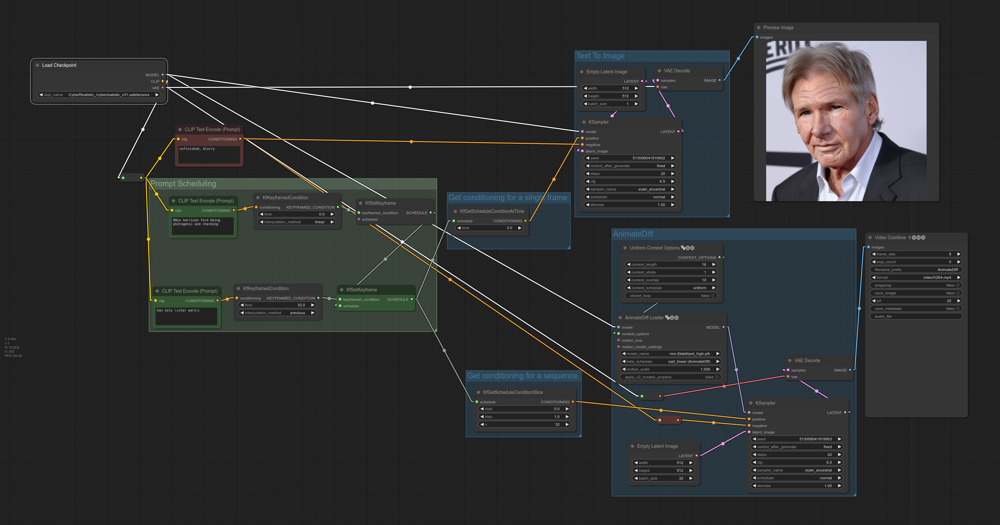
-->

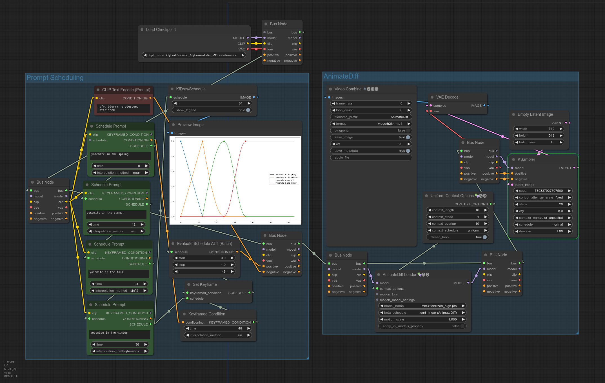

 This one is probably why you are here. This workflow demonstrates how to use the `keyframed/schedule` nodes to achieve similar behavior as [FizzNodes'](https://github.com/FizzleDorf/ComfyUI_FizzNodes) **PromptSchedule** node, but implemented differently.

This schedule is essentailly a normal AnimateDiff workflow where several nodes have replaced the normal conditioning setup. Rather than a single `CLIP Text Encode` node, we can have multiple prompts which transition sequentially over time. 

Here's a more fully worked version of the workflow above (adds a second refinement pass of AnimateDiff, FiLM VFI, and upscaling).

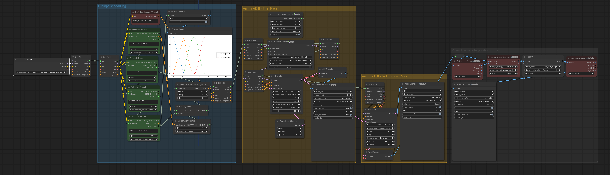

These workflows illustrate the most user-friendly prompt-scheduling interface, but there are "lower-level" nodes as well for more complex bespoke scheduling.

## Interleaving Multiple Prompts Simultaneously (aka Prompt Entanglement, aka Prompt Superposition)

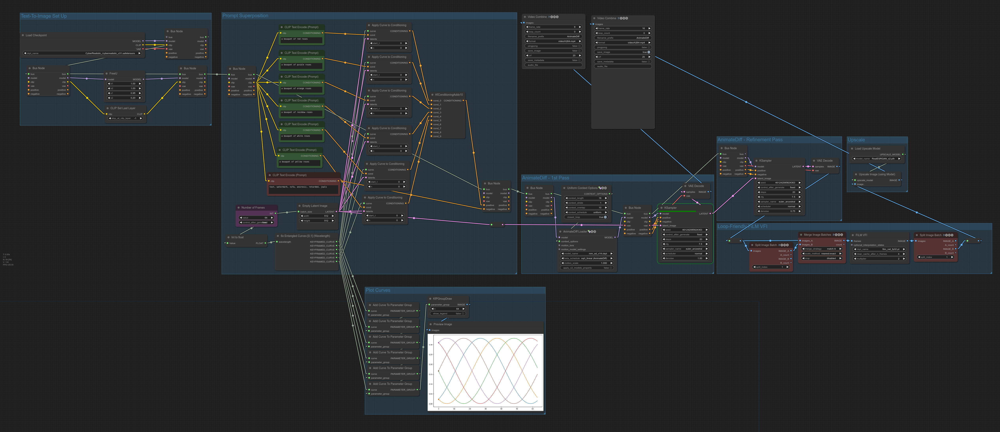

Workflow output: https://twitter.com/DigThatData/status/1733416414864957484

Workflow features:

* 6x Prompt superposition
* Second pass of AnimateDiff with denoise reduced to serve as a "refinement pass"
* FiLM Video Frame Interpolation (VFI) modified to interpolate looping videos correctly
* ESRGAN 2x Upscaling

The "Nx Entangled Curves" nodes generate N sinusoidal curves whose phases are offset to be equally spaced and whose amplitudes are adjusted such that the sum of all curves at any time is 1. 

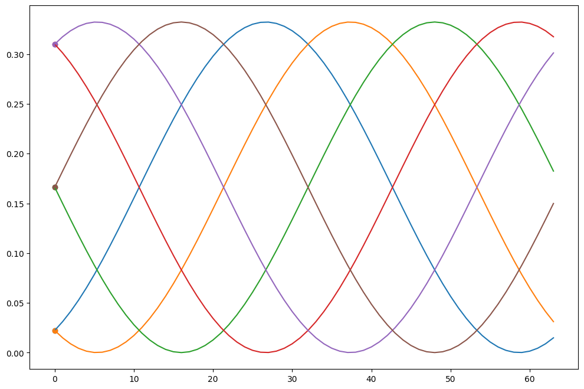

This can be used to create a "prompt superposition" effect, where all prompts contribute at any given time, and their relative strengths varies throughout the animation, each taking turns being the strongest or weakest contributor to the conditioning. This differs from the "prompt scheduling" workflow above, where at most two prompts are active at any given time (i.e. during transitions between keyframes).

For documentation detailing how this workflow works, see the [`Nodes > Entangled Curves`](https://github.com/dmarx/ComfyUI-Keyframed?tab=readme-ov-file#entangled-curves) section below.

## Simple Curved Parameter

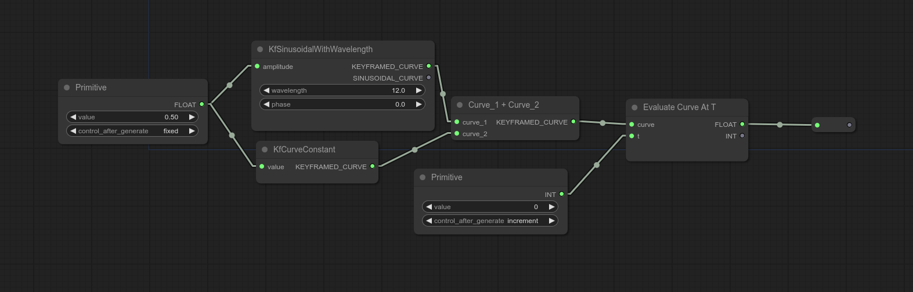

In this example we ilustrate how arithmetic can be performed on curves. Curves also support arithmetic operations against floats and ints, e.g. `myCurve * 3`.

## Multi-Prompt Transition With Manually Specified Curves

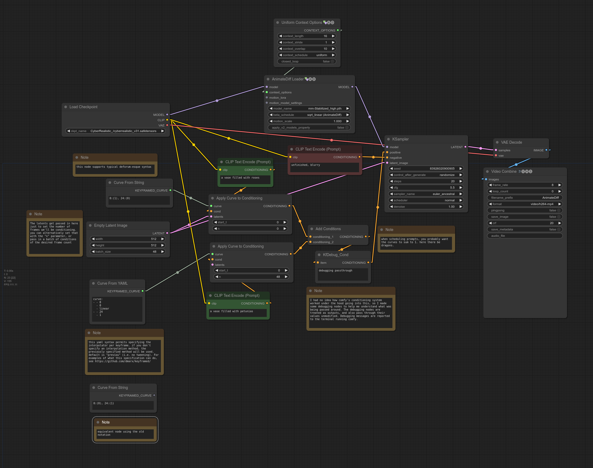

If you're feeling adventurous, this workflow demonstrates how you would use the curve objects directly to acheive the same thing as a schedule. Each prompt gets its own seaparate curve indicating the weight of the prompt at that time (you probably want the various conditionings weights to sum to 1 when combined. If you need to "fill" missing conditioning weight, try using an empty prompt).

## Parameter Groups and Curve Drawing Utilities

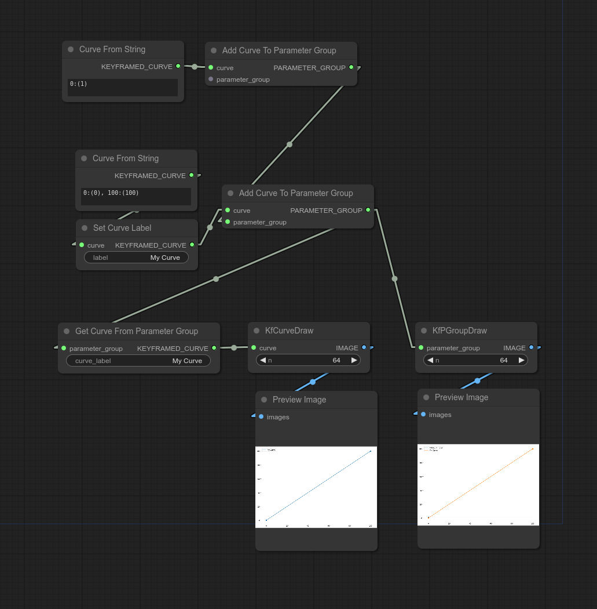

Parameter Groups can be used to carry around multiple curves around. If you want to attach a curve to a parameter group, it will need a label.

We provide utilities for drawing curves. You can draw multiple curves simultaneously by collecting them in a parameter group. The labels you give the curves will also be used as labels for plotting. You can also plot labels you haven't curves (a label was randomly generated when the curve was initialized).

# Nodes

## Curve Constructors

### Curve From String

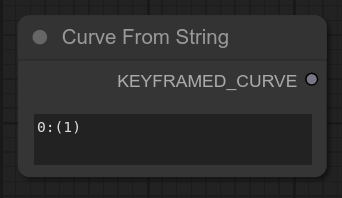

Supports commonly used notation for curved parameter. See also Deforum, FizzNodes, https://www.chigozie.co.uk/keyframe-string-generator/

### Curve From YAML

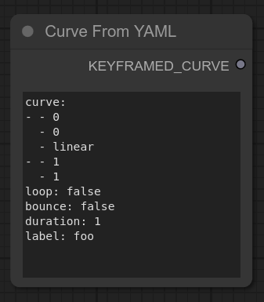

Supports curved parameter notation used by https://github.com/dmarx/keyframed

### Constant-Valued Curve

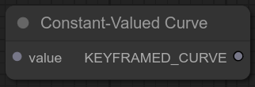

Returns a curve which evaluates to the same value for all values of `t` (time). Especially useful for curve arithmetic.

### Entangled Curves

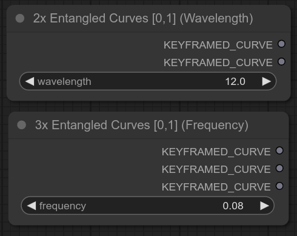

Each output curve of the node is a sine wave that oscillates from `0` to `1` at the given frequency or wavelength. The outputs of a given node are phase-offset such that at any given time, the sum of the generated curves is `1`. 

Reference the [Prompt Interleaving Workflow](https://github.com/dmarx/ComfyUI-Keyframed/blob/dev/README.md#prompt-interleaving-aka-prompt-entanglement-aka-prompt-superposition) for a demonstrative example.

## Curve Operators

### Evaluate Curve At T

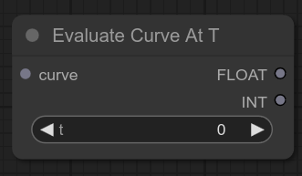

### Apply Curve To Conditioning

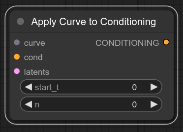

Generates a batch of `n` conditionings multiplying each conditioning by th value of the curve at that conditioning's index within the batch. If a batch of latents is provided, `n` is ignored and the size of the latent batch is used. If the provided conditioning object has batch size > 1, the conditioning's batch size takes priority over the latent batch size and `n`.

### Add Conditions

If you're using the `x10` node, at least `curve_0` must be non-empty. The other cond positions are all optionally populated.

### Curve Arithmetic Operators

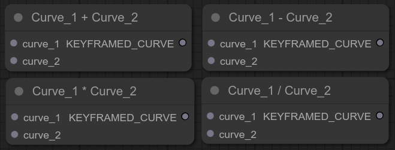

Arithmetic is performed at the union of keyframes of the provided curves.

NB: the division operator is unreliable at the time of this writing (2023-12-09).

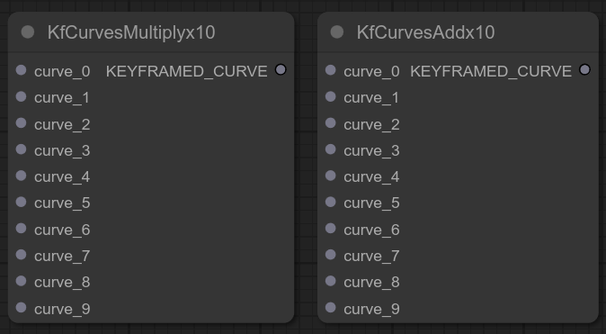

If you have lots of curve objects to multiply together or add together, here are some convenience nodes.

## Scheduling

These nodes work together to facilitate transitioning through a sequence of conditionings (i.e. prompts). We'll call this sequence the "schedule" of the conditionings. The primary use case here is for manipulating the positive prompt, i.e. for building a "prompt schedule". Given a particular time (e.g. frame id) in an animation sequence, we can query the prompt schedule at that time to get the appropriate conditioning to pass to the KSampler. 

Reference the [Prompt Scheduling Workflow](https://github.com/dmarx/ComfyUI-Keyframed/tree/dev?tab=readme-ov-file#prompt-scheduling) for a demonstrative example

### Schedule Prompt

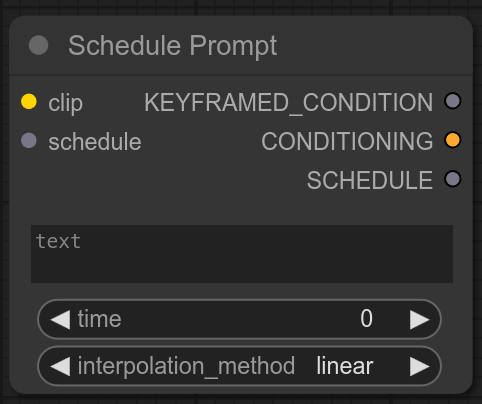

This will be the "workhorse" node provided by this package for the majority of people. It combines the nodes `CLIPTextEncode`, `Keyframed Condition`, and `Set Keyframe` (the latter two described below). It offers three outputs, but you will generally only need the `SCHEDULE` output. If an input `schedule` is not provided, a new `SCHEDULE` object will be created and provided at the output, which you can then pass to subsequent `Schedule Prompt` nodes to add keyframed conditions to the same schedule.

### Keyframed Condition

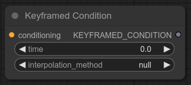

This node attaches a `conditioning` to a `keyframe`. This let's us assign a time to the conditioning and set what interpolation method to use when we're between keyframes. 

#### Interpolation Methods

Consider three time points `a,b,c` such that `a<b<c`, and two keyframes `X,Y` such that `X.time = a` and `Y.time = c`. To interpolate a value at time `b`, we would use `X.interpolation_method` to "tween" the value between `X.value` and `Y.value`. 

* **`null`** - If the interpolation value is not set, the default interpolation is "previous".
* **`previous`** - `X.time`
* **`next`** - `Y.time`
* **`linear`** - normal linear lerp. Matches the behavior of Deforum and FizzNodes.
* **`sine_wave`** - sine function easing. slower close to terminal values, fastest at the middle of the transition.
* **`eased_lerp** - sin2 easing. similar to sine but starts and ends slower and the fastest part is faster.
* **`exp_decay`** - starts fast ends slow.

### Set Keyframe

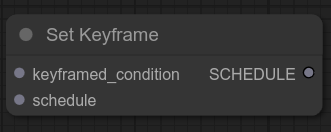

Attaches a keyframe to a schedule. If you haven't created a schedule yet, pass your keyframe into this node to create one, then pass the output schedule to subsequent `Set Keyframe` nodes to attach additional keyframes to the schedule. The first keyframe in the schedule should always be at `time=0`.

### Evaluate Schedule

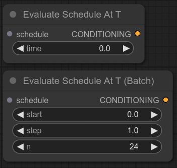

Evaluate the schedule at a time or time slice to extract a single conditioning or conditioning batch (respectively) to provide to e.g. a KSampler. The non-batch version gives the same kind of conditioning you'd get from a `CLIPTextConditioning` node. The intention of the batch version is to use with AnimateDiff to apply different conditionings per frame.

