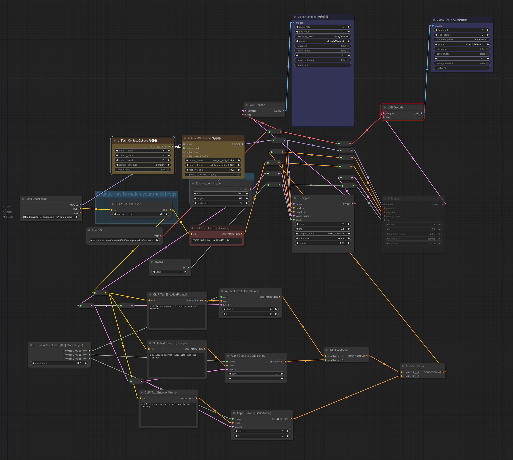

# ComfyUI-Keyframed

🚧 Work In Progress 🚧 - ComfyUI nodes to facilitate value keyframing by providing an interface for using [keyframed](https://github.com/dmarx/keyframed) in ComfyUI workflows.

...Open question: if I make this, what will differentiate it from https://github.com/FizzleDorf/ComfyUI_FizzNodes ?

* easier curve composition
* easier to change interpolators/easing functions

# Philosophy

Treat curves/schedules and keyframes as objects that can be passed around, plugged and unplugged, interchanged, and manipulated atomically.

# Starter Workflows

## Prompt Scheduling

## Prompt Entanglement (aka Prompt Superposition)

## Simple Curved Parameter

