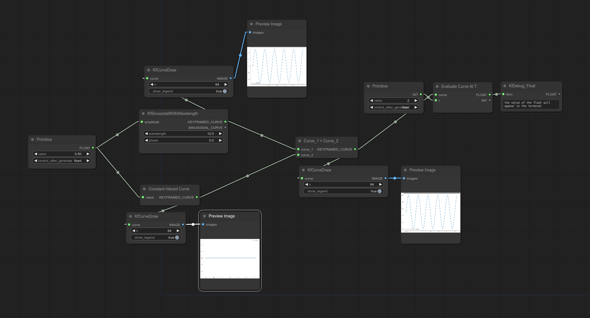
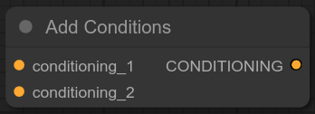

# ComfyUI-Keyframed

🚧 Work In Progress 🚧 - ComfyUI nodes to facilitate value keyframing by providing an interface for using [keyframed](https://github.com/dmarx/keyframed) in ComfyUI workflows.

...Open question: if I make this, what will differentiate it from https://github.com/FizzleDorf/ComfyUI_FizzNodes ?

* easier curve composition
* easier to change interpolators/easing functions

# Philosophy

Treat curves/schedules and keyframes as objects that can be passed around, plugged and unplugged, interchanged, and manipulated atomically.

# Starter Workflows

## Prompt Scheduling

 This one is probably why you are here. This workflow demonstrates how to use the `keyframed/schedule` nodes to achieve similar behavior as [FizzNodes'](https://github.com/FizzleDorf/ComfyUI_FizzNodes) **PromptSchedule** node, but implemented differently.

This schedule is essentailly a normal AnimateDiff workflow where several nodes have replaced the normal conditioning setup. Rather than a single `CLIP Text Encode` node, we can have multiple prompts which transition sequentially over time. For documentation detailing how this workflow works, see the `Nodes > Scheduling` section below.

## Prompt Interleaving (aka Prompt Entanglement, aka Prompt Superposition)

Which is the node equivalent for achieving this type of thing

## Simple Curved Parameter

## Multi-Prompt Transition With Manually Specified Curves

# Nodes

## Curve Constructors

### Curve From String

### Curve From YAML

### Constant-Valued Curve

### Entangled Curves

## Curve Operators

### Evaluate Curve At T

### Apply Curve To Conditioning

### Add Conditions

### Curve Arithmetic Operators

NB: the division operator is unreliable at the time of this writing (2023-12-09).

## Scheduling

### Keyframed Condition

### Set Keyframe

### Evaluate Schedule

